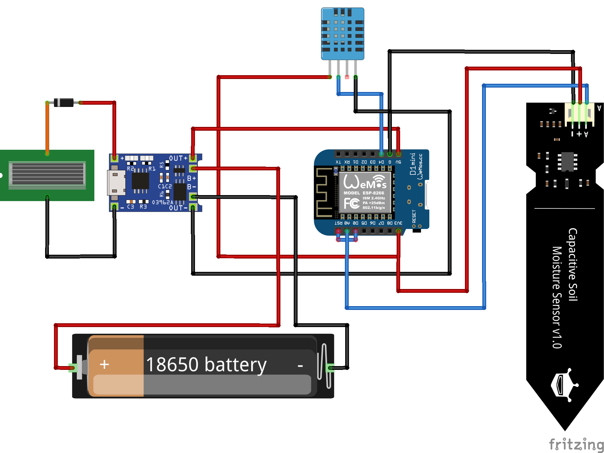

# ppMicro
Microcontroller source codes.

This repository contains the source codes that will be loaded onto the respective micro-controllers using Arduino-IDE.

The electronic circuit of the micro controller is given as:\

ESP_8266_V1: \
&emsp;	Installed Sensors: DHT11, Moisture Sensor \
&emsp;	Infrastructure: WLAN Data: soil_moisture_analog (from 0 to 1024), soil_moisture (in %), air_temperature (in C), air_humidity, heat_index_C (felt temperature in C) \
&emsp;	Content: Reading sensors and transferring the content to a server as a JSON with UNIX timestamps
